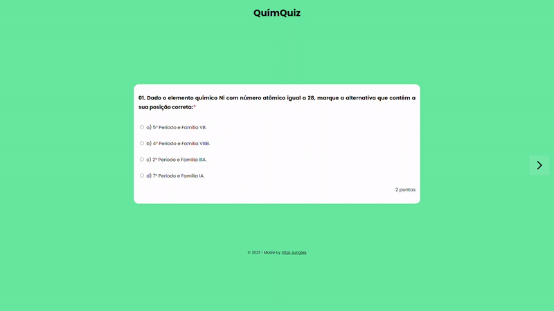

<h1 align="center">QuímQuiz</h1>

## :pushpin: O que é o QuímQuiz?
O QuímQuiz é um website divertido e educativo onde se encontrarão perguntas relacionadas à matéria escolar de Química.

## :thinking: Qual o objetivo do QuímQuiz?
O objetivo desse projeto é aproximar os estudos de Química aos usuários por meio de um quiz interativo.

## :question: Como funciona o QuímQuiz?
O QuímQuiz terá 7 perguntas sobre Química, cada uma valendo 2 pontos, totalizando assim 14 pontos sendo que de acordo com a nota final tirada o website se comportará de uma maneira diferente.

## :computer: Quais tecnologias são usadas?
As tecnologias utilizadas nesse projeto são: HTML5, CSS3 e JavaScript.

## :pencil: Licença
Este projeto está sob a licença MIT. Leia o arquivo [LICENSE](https://github.com/vitorjungles/quimquiz/blob/master/LICENSE) para mais informações.

## :arrow_right: Como acessar o QuímQuiz?
Para testar seus conhecimentos no mundo da Química acesse [este site aqui](https://vitorjungles.github.io/quimquiz/). Boa sorte à todos os participantes. :four_leaf_clover: